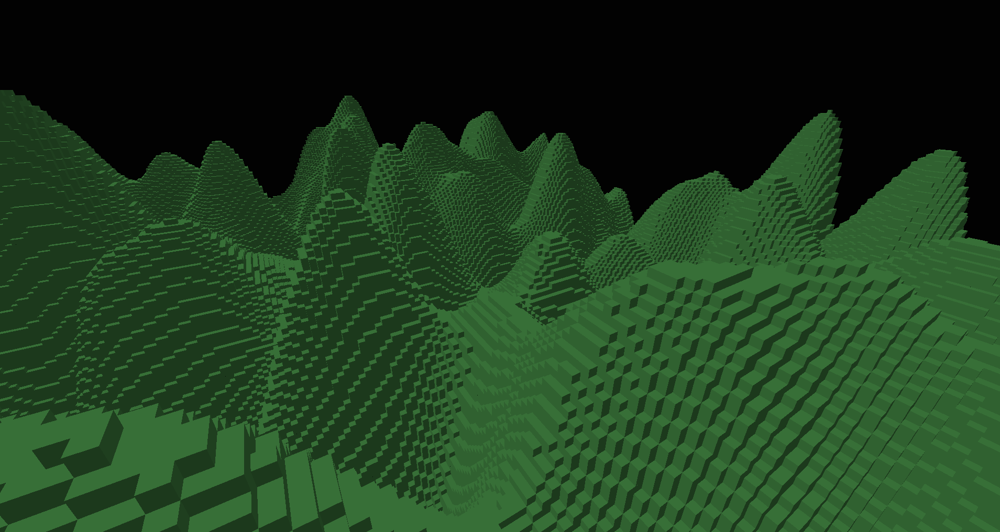

# Voxellator
### Controls
Press L to lock and unlock the camera. This switches between the mouse being free and stuck in the window.
WASD for movement, Space to ascend, LShift to descend.

This is a hobby project I'm writing to get familiar with programming voxels, and play around
with different methods of doing terrain generation, voxel meshing, and shading.
This is also an experiment in using minimal libraries and external code bases.
I'm rolling my own platform layers to practice platform abstraction (although I have only done
Win32 at the moment). I do use the CRT, but I may move away from it in the future.

The project is compiled with C++, but I stick to a small subset of C-like features.
I don't use member functions or classes much, but I will occasionally use operator overloading and destructors.

## The Gist

The codebase is designed around a unity build system.
Instead of compiling each cpp file individually, the compiler targets a single cpp file, which #includes
all other files into one compilation unit, which gets compiled in a single step.
This rapidly decreases compile time, since minimal time is spent linking individual .o/.obj files together.
I chose to have the compiler target a single platform specific file (e.g. win32_vox.cpp), which #includes
vox_main.cpp, which in turn #includes all other source files.

### Building

Build scripts reside in each platform-specific folder, and invoke the compiler for the given platform.
They also copy shaders and any other resources to the working directory.

On Win32 I compile with Visual Studio 2015, and try to maintain compatibility with 2013 and 2017.

Once the linux platform layer begins, I will try to maintain compatibility with gcc and clang.

### Exploring

Each platform file is responsible for creating the entry point, implementing a sim loop, and calling
in to vox_main.cpp and providing the platform API described in vox_platform.h.
The platform calls init() once, and then tick() at 60fps, in vox_main.cpp.
Some of the platform code is pretty sketchy right now.

TODO: Add more stuff here

## TODO

- [x] Culled meshing
- [x] Greedy meshing
- [ ] Dynamic chunk loading
- [ ] ???
